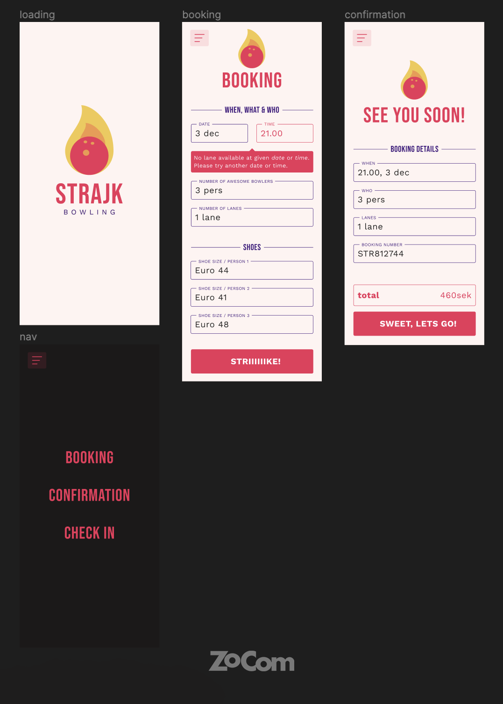

<section style="padding: 1rem; font-size: 1.4rem; background-color: #EC315A; color: #FFF4F1; border-radius: 4px; margin: 1rem 0;">
Hej och välkommen till detta lilla kodtest som kommer ta dig ca 2h att genomföra. Syftet med testet är <em>flexa dina utvecklar-muskler</em> samt <em>förse oss med samtalsunderlag vid inbokad avstämning.</em> Visa vad du går för!

Du jobbar direkt i detta repo, men jobba gärna enligt [gitflow](https://www.atlassian.com/git/tutorials/comparing-workflows/gitflow-workflow) eller annan [vedertagen git-strategi](https://www.flagship.io/git-branching-strategies/).

</section>

## Om projektet

**Strajk bowling är en nyöppnad bowlinghall i centrala Bromölla. Ägaren K. Ägla gillar tekniska lösningar och har tillsammans med brorsonen Keso Ägla [designat en mockup](https://www.figma.com/file/67YvtKEq7iljjXqjGvJRMx/Strajk-1.0?node-id=0%3A1).**
**Herr Ägla är väldigt nöjd med designen och vill att appen ser ut och fungerar enligt angiven spec. Gränssnittet behöver endast vara anpassat efter mobila enheter.**

## Val av tekniker

- React
- Scss ( optional )
- Typescript ( optional )

## Krav

**Användaren ska i frontend kunna:**

- Boka en bana för N antal personer
- Boka N antal skor
- Se en bekräftelse på sin bokning

| View Namn    | Funktionalitet                                                                                                                                                                                                                         |
| ------------ | -------------------------------------------------------------------------------------------------------------------------------------------------------------------------------------------------------------------------------------- |
| Loading      | Kan visas vid inläsning av cachead sida. Optional.                                                                                                                                                                                     |
| Booking      | Användaren ska kunna boka _datum_ och _tid_ samt ange _antal spelare_. Vid val av spelare skall formulär för skobokning dyka upp. Väljs ex. 3 spelare, dyker 3 inputfält upp. Vid knapp på strike skickas _request_ iväg till servern. |
| Confirmation | Vid ivägskickad request fås en bokning tillbaka inkl totalsumma ( 120kr / pers + 100kr / bana )och bokningsnummer.                                                                                                                     |
| Meny         | Vid klick på _naviconen_ visas menyn på lämpligt sätt.                                                                                                                                                                                 |



## Backend API

Din app ska skicka en `booking request` bokningar till Strajks backend. Du får då tillbaka ett `booking response`.

Se nedan för detaljer.

**Main REST endpoint.**

```
https://h5jbtjv6if.execute-api.eu-north-1.amazonaws.com
```

**För _Auth_, använd headern `x-api-key` i din http-request med API-nyckel:**

```
738c6b9d-24cf-47c3-b688-f4f4c5747662
```

## Models

### Booking Model

**Request**

```json
{
  "when": "2022-11-11T18:00",
  "lanes": 1,
  "people": 4,
  "shoes": [38, 39, 44, 43]
}
```

**Response**

```json
{
  "when": "2022-11-11T18:00",
  "lanes": 1,
  "people": 4,
  "shoes": [38, 39, 44, 43],
  "price": 580, // räknas ut på serversidan
  "id": "str7283472", // genereras på serversidan
  "active": true // anges på serversidan.
}
```

Lycka till, och vid frågor kontakta *johan.kivi@zocom.se*
